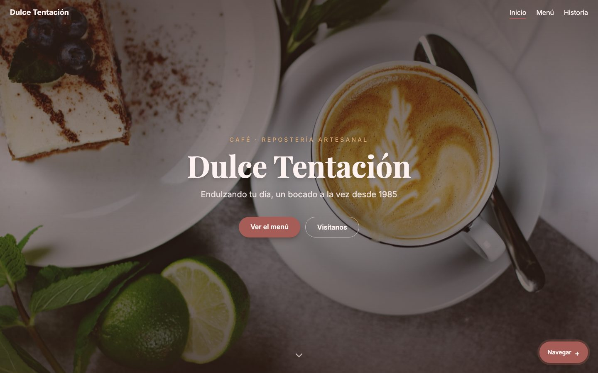
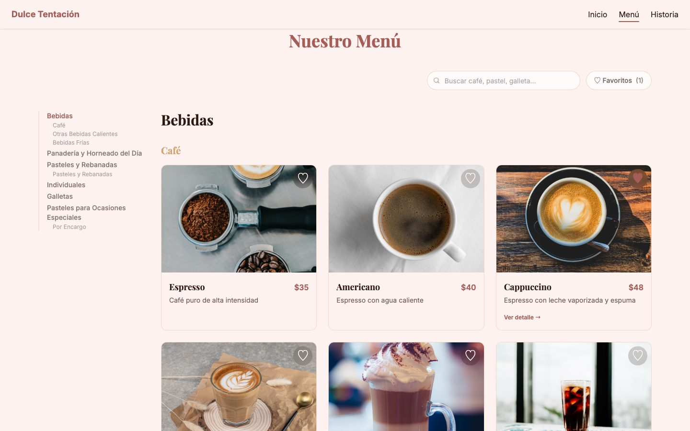
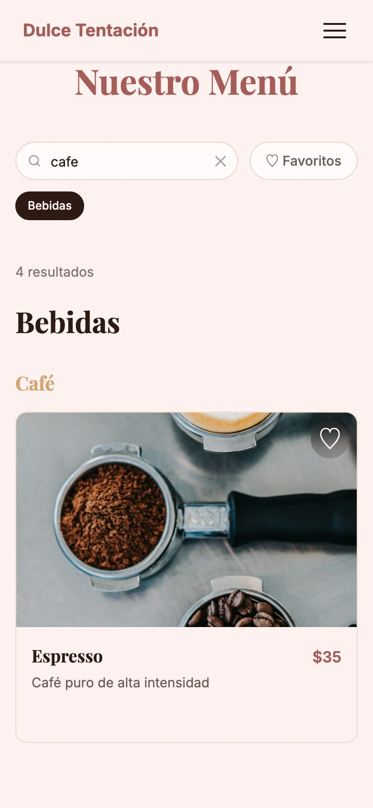
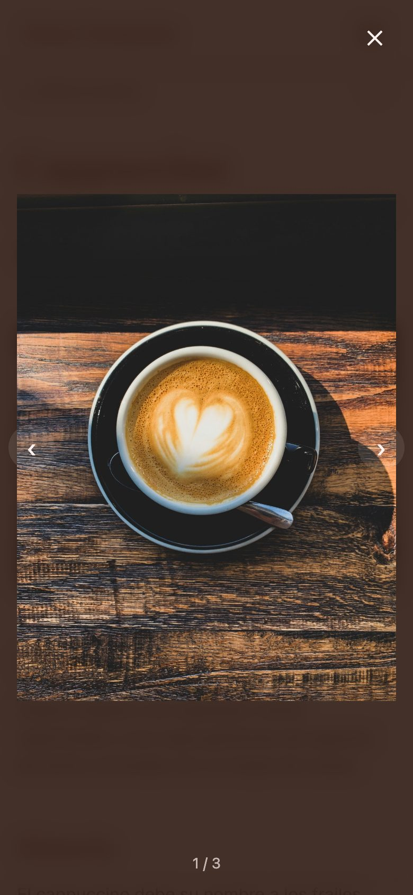
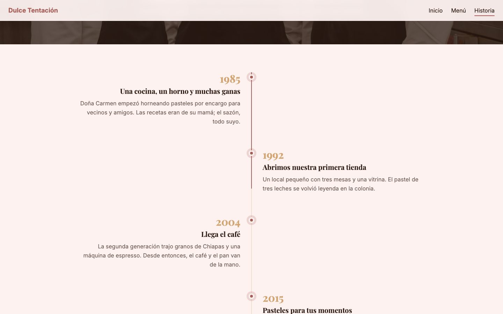

# Dulce Tentación · Café y repostería artesanal

[](https://github.com/LeonelRosado2407/dessert-page/actions/workflows/ci.yml)
[](https://dulce.leonelrosado.dev)
[](LICENSE)


Sitio web y **menú en línea** para una cafetería-pastelería mexicana (ficticia). El objetivo: una página vistosa, con animaciones suaves e interacciones claras, que además le sirva al cliente para consultar el menú, los precios y el horario desde el celular.

**Demo:** [dulce.leonelrosado.dev](https://dulce.leonelrosado.dev)



## Funcionalidades

**Menú en línea**
- 33 productos agrupados por categoría y subcategoría, con precio en MXN ("Por cotizar" en pedidos especiales).
- **Búsqueda sin acentos**: "cafe" encuentra "Café"; busca en nombre y descripción.
- **Favoritos** persistentes (`localStorage`) con filtro dedicado.
- La búsqueda y los filtros viven en la URL (`/productos?q=cafe&fav=1`): se pueden compartir y sobreviven al botón de atrás.
- Navegación por categorías: barra lateral en escritorio y chips horizontales en móvil, ambas resaltan la sección visible.
- Detalle de producto con galería y **lightbox** (teclado, flechas y cierre con Escape).

**Diseño e interacción**
- Animaciones al hacer scroll con `IntersectionObserver`, aparición escalonada de tarjetas, transiciones entre páginas y micro-interacciones (corazón con "pop", hover con zoom).
- Respeta `prefers-reduced-motion`: si el sistema lo pide, se desactivan animaciones y scroll suave.
- Indicador **"Abierto ahora / Cerrado"** calculado a partir del horario.
- Página de **Historia** con línea de tiempo que se dibuja conforme avanzas.
- Placeholder con la paleta del sitio cuando una foto no existe o falla al cargar.
- Responsive de 375px en adelante, navbar con menú hamburguesa, página 404 y títulos por ruta.

| Menú (escritorio) | Búsqueda (móvil) | Lightbox (móvil) |
| --- | --- | --- |
|  |  |  |



## Stack

- **Vue 3** (Composition API, `<script setup>`) + **TypeScript**
- **Vite** como bundler y servidor de desarrollo
- **Tailwind CSS v4** con tokens de diseño propios (`@theme`)
- **Vue Router** (rutas lazy, `scrollBehavior` personalizado) y **Pinia**
- **Vitest** + **Vue Test Utils** para pruebas unitarias y de componentes
- **Playwright** para pruebas end-to-end
- **GitHub Actions**: lint, type-check, pruebas y build en cada push y PR
- **oxlint + ESLint + Prettier**
- Desplegado en **Vercel**

## Decisiones técnicas

- **Contenido como datos.** Todo el contenido (productos, empresa, horario, historia, FAQ, reseñas) está en JSON dentro de `src/data/`. Cambiar el menú no requiere tocar componentes, y la estructura está lista para migrar a un CMS o API.
- **Estado en la URL.** Los filtros del menú se sincronizan con la query string en ambos sentidos. El `scrollBehavior` del router ignora los cambios de query en la misma página, para que escribir en el buscador no mueva el scroll, y restaura la posición al volver.
- **Animaciones sin conflictos.** En las tarjetas, un contenedor maneja la aparición (con retraso escalonado) y otro el hover (sin retraso), así el `transition-delay` no hace lento el hover.
- **Accesibilidad.** Links reales en las tarjetas (navegables con teclado), `aria-label`/`aria-pressed` en favoritos, diálogo modal accesible en el lightbox y soporte de movimiento reducido.
- **Rendimiento.** Imágenes redimensionadas y comprimidas, `loading="lazy"` y rutas con carga diferida.

## Estructura

```
src/
├── components/
│   ├── home/          # Secciones del inicio (hero, galería, reseñas, contacto…)
│   ├── layout/        # Navbar, footer, indicador de horario
│   ├── productos/     # Tarjeta, imagen con placeholder, favorito, lightbox
│   └── historia/      # Línea de tiempo
├── composables/       # useInView (animaciones al hacer scroll)
├── data/              # Contenido en JSON
├── router/
├── stores/            # Favoritos (Pinia + localStorage)
├── utils/             # Precio, horario, scroll
└── views/
```

## Correr el proyecto

Requiere Node `^22.18.0` o `>=24.12.0`.

```sh
npm install
npm run dev          # servidor de desarrollo
npm run build        # type-check + build de producción
npm run lint         # oxlint + eslint
```

### Pruebas unitarias

```sh
npm run test:unit                          # modo watch
npx vitest run                             # una sola corrida
```

Cubren el formato de precios, el cálculo de "abierto ahora" (horas límite y días cerrados), la búsqueda sin acentos, el store de favoritos y los componentes de tarjeta e imagen con placeholder.

### Pruebas end-to-end

```sh
npx playwright install                     # solo la primera vez
npm run test:e2e                           # contra el servidor de desarrollo
```

Para correrlas sin abrir el navegador, contra el build de producción:

```sh
npm run build && CI=1 npx playwright test --project=chromium --reporter=list
```

---

## Licencia

El código está bajo la licencia [MIT](LICENSE). Las fotografías se incluyen solo como demostración y pertenecen a sus respectivos autores.

> El negocio, sus datos de contacto y su historia son ficticios.
